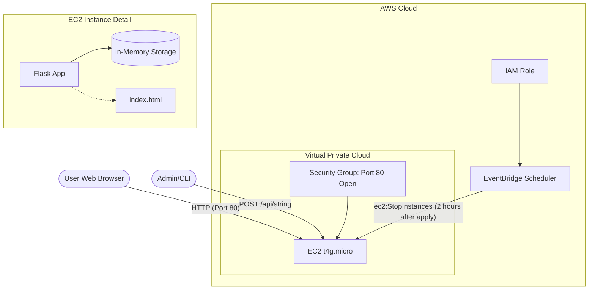

# Real-Time Dynamic String Service on AWS

Real-Time Dynamic String Service using AWS EC2, Terraform, Flask, and HTML. A specific string can be updated in real-time via a REST API without requiring a page refresh or re-deployment.

## 1. Overview

The project implements a **Serverless-lite** architecture on AWS, optimized for **minimum cost** and **maximum simplicity**.

- **Frontend**: A minimal HTML page with a JavaScript polling mechanism.
- **Backend API**: A Python Flask application providing a RESTful interface.
- **Infrastructure**: Provisioned entirely via Terraform (IaC).
- **Cost Protection**: Automatic shutdown scheduled 2 hours after deployment using EventBridge Scheduler.

---

## 2. Infrastructure Diagram



---

## 3. AWS Services Used

| Service                    | Purpose                                  | Cost Detail                   |
| :------------------------- | :--------------------------------------- | :---------------------------- |
| **Amazon EC2 (t4g.micro)** | Hosts the Python/Flask web server.       | Free Tier (750 hrs/month).    |
| **Amazon VPC (Default)**   | Provides the networking environment.     | $0.00 (No NAT Gateways used). |
| **AWS IAM**                | Manages permissions for auto-shutdown.   | $0.00.                        |
| **Amazon EventBridge**     | Schedules the automatic 2-hour shutdown. | Free Tier (Custom events).    |
| **Terraform**              | Infrastructure as Code orchestration.    | N/A (Client-side).            |

---

## 4. Technical Decisions

### EC2 t4g.micro

This is a simple proof-of-concept project. While AWS Lambda is an alternative, a small EC2 instance allows for a very straightforward Flask implementation where the dynamic string can be kept in-memory for simplicity, avoiding the need for a database like RDS or DynamoDB, and reducing architectural complexity and cost.

### In-Memory Storage

The dynamic string is stored in-memory, which means it will be lost if the instance is stopped or restarted. This is a deliberate design decision to keep the architecture simple and cost-effective. For a production environment, a database like DynamoDB or RDS would be used to store the string.

### Polling

To achieve "Real-Time" without a refresh, WebSockets are the gold standard. However, they add significant complexity (connection management, load balancer requirements, etc.). Polling every 1.5 seconds provides a perceived "real-time" experience while keeping the code simple and clean.

### EventBridge Scheduler

EventBridge Scheduler is used to automatically stop the EC2 instance exactly two hours after the Terraform script has been applied. This is done to avoid incurring unnecessary costs, ensuring that the instance doesn't run indefinitely if forgotten. The EC2 instance can be started again manually or by running the `terraform apply` command again.

---

## 5. Project Structure

Organizing the codebase separately from infrastructure is a key best practice.

```text
.
├── src/                # Application & Tests Layer
│   ├── app.py          # Python Flask Backend
│   ├── templates/      # HTML Frontend
│   └── tests/          # Unit Tests
│       └── test_app.py
└── terraform/          # Infrastructure Layer (AWS)
    ├── scripts/        # Bootstrap scripts (setup.sh)
    └── *.tf            # Modular Terraform files (main, data, iam, etc.)
```

---

## 6. Setup & Usage Instructions

### Prerequisites

- Python 3.x
- AWS CLI configured with `default` credentials.
- Terraform installed.

### Local Development & Testing

Before deploying, you can run the application locally and execute unit tests.

1. **Install dependencies**:

   ```bash
   pip install -r src/requirements-dev.txt
   ```

2. **Run Unit Tests**:

   ```bash
   PYTHONPATH=. pytest src/tests/
   ```

3. **Run App Locally**:

   ```bash
   python src/app.py
   # Access at http://localhost:80
   ```

4. **Update the string via terminal**:
   ```bash
   curl -X POST -H 'Content-Type: application/json' -d '{"string": "This is a test"}' http://localhost:80/api/string
   ```

### Deployment

1. Navigate to the infrastructure folder:
   ```bash
   cd terraform
   ```
2. Initialize and Apply:
   ```bash
   terraform init
   terraform apply -auto-approve
   ```

### Test

1. Get the URL and Curl Example from the Terraform outputs:
   - **Frontend URL**: `http://<EC2_IP>`
   - **API Update Endpoint**: `http://<EC2_IP>/api/string`
   - **Curl Example**: `update_string_curl_example`

2. Update the string via terminal:
   ```bash
   curl -X POST -H 'Content-Type: application/json' -d '{"string": "This is a test"}' http://<EC2_IP>/api/string
   ```

---

## 7. Next Steps

1. **Persistence Layer**: Introduce **Amazon DynamoDB** or **Amazon RDS** to keep the string safe across server restarts.
2. **WebSockets**: Replace polling with a push mechanism for ultra-low latency.
3. **HTTPS**: Secure the service with **AWS Certificate Manager** and **AWS WAF**.
4. **Containerization**: Use **Docker** and **AWS Fargate** for a more scalable architecture.
5. **Monitoring**: Add **Amazon CloudWatch** to monitor the service and set up alarms for high CPU usage or error rates.
6. **CI/CD**: Implement a **GitHub Actions** pipeline to automate the deployment of the service to AWS.
7. **Admin UI**: Add an admin UI to update the string. This interface should be protected with a password and reutilize the current API.
8. **Token Security**: The API should implement authentication via tokens to ensure that only authorized users can update the string.
